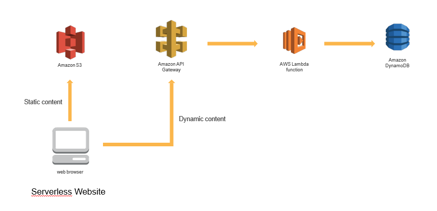

# UNITHON 5th 서버리스 데모 가이드

이 문서는 Amazon S3, AWS Lambda, Amazon API Gateway, Amazon DynamoDB 및 기타 서비스를 사용하여 서버리스 To-Do 응용 프로그램을 구축하는 과정을 안내하는 워크샵 가이드와 자료들을 제공합니다.

전체 아키텍처의 그림은 아래 다이어그램을 참조하십시오.



# 모듈 1 : S3 Static Web Hosting

### 1. S3 버킷 생성

콘솔 또는 AWS CLI를 사용하여 Amazon S3 버킷을 생성하십시오. 버킷의 이름은 전 세계적으로 고유해야합니다. `unithon-yourname`와 같은 이름을 사용할것을 권장합니다.

<details>
<summary><strong>단계별 지침 (자세한 내용을 보려면 펼쳐주세요)</strong></summary><p>

1. AWS Management Console에서 **Services** 를 선택한 다음 **S3** 를 선택하십시오.

1. **+Create Bucket** 을 선택하십시오.

1. `unithon-yourname`와 같은 전 세계적으로 고유한 이름을 설정하십시오.

1. 드롭다운 메뉴에서 이 실습에서 사용할 리전을 선택하십시오.

1. 설정을 복사할 버킷을 선택하지 않고 대화상자의 왼쪽 하단에 있는 **Create** 를 선택하십시오.

</p></details>

### 2. 콘텐츠 업로드

[demo.zip](./files/demo.zip) 압축파일을 다운로드 한 다음 압축을 풀고, 폴더 안에 있는 index.html 파일을 사용자가 생성한 버킷에 업로드해서 이용하실수도 있습니다.

demo 압축파일을 풀고, index.html 파일을 방금전 생성한 S3 버킷에 업로드합니다.

### 3. 버킷 정책에 Public Reads 권한을 허용

익명 사용자가 사이트를 볼 수있게하려면 버킷 정책을 새 Amazon S3 버킷에 추가해야합니다. 기본적으로 버킷은 AWS 계정에 대한 액세스 권한이있는 인증 된 사용자 만 액세스 할 수 있습니다.

부여할 정책에 대한 설정은 [이 예제](http://docs.aws.amazon.com/AmazonS3/latest/dev/example-bucket-policies.html#example-bucket-policies-use-case-2) 를 참고하십시오. 익명 사용자에 대한 읽거 전용 액세스. 이 예제 정책은 인터넷상의 모든 사용자가 귀하의 콘텐츠를 볼 수있게합니다. 버킷 정책을 업데이트하는 가장 쉬운 방법은 콘솔을 사용하는 것입니다. 버킷을 선택하고 권한(Permissions) 탭을 선택한 다음 버킷 정책(Bucket Policy)을 선택하십시오.

<details>
<summary><strong>단계별 지침 (자세한 내용을 보려면 펼쳐주세요)</strong></summary><p>

1.  S3 콘솔에서 섹션 1에서 생성 한 버킷의 이름을 선택하십시오.

1. **Permissions** 탭을 선택한 다음, **Bucket Policy**를 선택하십시오.

1. 다음 정책 문서를 버킷 정책 편집기에 입력하고 `YOUR_BUCKET_NAME` 을 여러분이 생성한 버킷 이름으로 변경하십시오.

    ```json
    {
        "Version": "2012-10-17",
        "Statement": [
            {
                "Effect": "Allow",
                "Principal": "*",
                "Action": "s3:GetObject",
                "Resource": "arn:aws:s3:::YOUR_BUCKET_NAME/*"
            }
        ]
    }
    ```

1. **Save** 버튼을 선택하여 새 정책을 적용하십시오.

</p></details>

### 4. 웹 사이트 호스팅 활성화

콘솔을 사용해서 정적 웹사이트 호스팅을 활성화합니다. 버킷을 선택한 후에 속성탭에서 이 작업을 수행할 수 있습니다. 

index document로 `index.html` 을 설정하고, error document는 비워두십시오.

자세한 내용은 [정적 웹 사이트 호스팅을 위한 버킷 구성](https://docs.aws.amazon.com/AmazonS3/latest/dev/HowDoIWebsiteConfiguration.html) 의 설명서를 참고하십시오.

웹 사이트 호스팅을 설정한 url을 메모장에 복사해두면 좋습니다.

<details>
<summary><strong>단계별 지침 (자세한 내용을 보려면 펼쳐주세요)</strong></summary><p>

1. S3 콘솔의 버킷 세부 사항 페이지에서, **Properties** 탭을 선택하십시오.

1. **Static website hosting** 을 선택하십시오.

1. **Use this bucket to host a website** 을 선택하고, index document에 `index.html`를 입력하십시오. 다른 입력칸은 비워둡니다.

1. 먼저 **Endpoint** URL 을 확인하십시오. 그 뒤에 **Save** 버튼을 클릭하십시오. 이 URL을 나머지 실습에서 웹 응용 프로그램을 볼 때 사용할 것입니다. 여기에서 이 URL을 귀하의 웹 사이트의 기본 URL이라고 합니다.

1. **Save**을 클릭하여 변경 사항을 저장하십시오.

    

</p></details>

# 모듈 2 : 서버리스 백엔드

### 1. Amazon DynamoDB 테이블 만들기

Amazon DynamoDB 콘솔을 사용해서 새로운 DynamoDB 테이블을 만드십시오. `mydb` 라는 테이블을 만들고 String 타입의 `id` 라는 파티션 키(Partition Key)를 부여하십시오. 다른 모든 설정에는 기본값을 사용하십시오.

<details>
<summary><strong>단계별 지침 (자세한 내용을 보려면 펼쳐주세요)</strong></summary><p>

1. AWS Management 콘솔에서, **Services** 를 선택한 다음 데이터베이스에서 **DynamoDB** 를 선택하십시오.

1. **Create table** 을 선택하십시오.

1. **Table name** 에 `mydb` 를 입력하십시오.

1. **Partition key** 에 대해 `id` 키 유형(key type) 으로 **String** 을 선택하십시오.

1. **Use default settings** 체크박스를 선택하고 **Create** 을 선택하십시오.

</p></details>

### 2. 람다 함수에 대한 IAM 역할 만들기

IAM 콘솔을 사용하여 새 역할을 만듭니다. 이름을 `UnithonLambdaRole` 로 지정하고 역할 유형으로 AWS Lambda를 선택하십시오. 함수 권한을 부여하는 정책을 첨부하여 Amazon CloudWatch 로그에 기록하고 항목을 DynamoDB 테이블에 저장해야합니다.

<details>
<summary><strong>단계별 지침 (자세한 내용을 보려면 펼쳐주세요)</strong></summary><p>

1. AWS Management Console 에서 **Services** 를 선택한 다음, Security, Identity & Compliance 섹션에서 **IAM** 을 선택하십시오.

1. 왼쪽 네비게이션바에서 **Roles** 을 선택하고 **Create new role** 를 선택하십시오.

1. 역할 유형(role type)으로 **AWS Lambda** 를 선택하십시오.

    **참고:** 역할 유형(role type)을 선택하면 AWS가 사용자를 대신해서 이 역할을 맡을 수 있도록 역할에 대한 신뢰 정책(trust policy)이 자동으로 생성됩니다. CLI, AWS CloudFormation 또는 다른 메커니즘을 사용해서 이 역할을 작성하는 경우 직접 신뢰 정책(trust policy)을 지정합니다.

1. **Filter** 압력란에 `AmazonDynamoDBFullAccess` 를 입력하고 해당 역할 옆의 확인란을 선택하십시오. (**주의!!** 데모에서는 빠른 진행을 위해서 전체 권한을 적용했지만, 실제로는 세세한 권한 설정을 해주는걸 권장합니다.)

1. **Next Step** 을 선택하십시오.

1. **Role name** 에 `UnithonLambdaRole` 를 입력하십시오.

1. **Create role** 을 선택하십시오.

</p></details>

### 3. 요청 처리를 위한 람다 함수 만들기

AWS Lambda 콘솔을 사용하여 API 요청을 처리할 `list`, `create` 라는 새로운 람다 함수를 만듭니다.

[demo.zip](./files/demo.zip) 파일에서 같이 제공된 [create.py](./files/create.py), [list.py](./files/list.py) 예제 구현을 사용하십시오.

해당 파일을 복사하여 AWS Lambda 콘솔 편집기에 붙여넣기만 하면 됩니다.

이전 섹션에서 작성한 `UnithonLambdaRole` IAM 역할을 사용하도록 함수를 설정해야합니다.

<details>
<summary><strong>create 함수 생성 단계별 지침 (자세한 내용을 보려면 펼쳐주세요)</strong></summary><p>

1. **Services** 를 선택한 다음 Compute 섹션에서 **Lambda** 를 선택하십시오.

1. **Create a Lambda function** 를 선택하십시오.

1. **Blank Function** 블루프린트를 선택하십시오.

1. 트리거를 지금 설정하지 마십시오. **Next** 를 선택하여 함수를 정의하는 부분을 진행합니다.

1. **Name** 입력칸에 `create` 를 입력하십시오.

1. description 입력칸은 옵션입니다.

1. **Runtime** 에 대해 **Python 2.7** 을 선택하십시오.

1. [create.py](./files/create.py) 의 코드를 복사하여 코드 입력 영역에 붙여 넣으십시오.

1. **Environment variables** 입력칸에 **Key** 값으로 `DYNAMODB_TABLE` 을 입력하고, **Value**에 `mydb` 를 입력합니다.

1. **Handler** 입력칸에 대해 `lambda_function.lambda_handler` 의 기본값 `lambda_function.create` 로 변경합니다.

1. **Existing Role** 드롭다운에서 `UnithonLambdaRole` 를 선택합니다.

1. **Next** 을 선택한 다음 리뷰 페이지에서 **Create function** 를 선택하십시오.

</p></details>

<details>
<summary><strong>list 함수 생성 단계별 지침 (자세한 내용을 보려면 펼쳐주세요)</strong></summary><p>

1. **Services** 를 선택한 다음 Compute 섹션에서 **Lambda** 를 선택하십시오.

1. **Create a Lambda function** 를 선택하십시오.

1. **Blank Function** 블루프린트를 선택하십시오.

1. 트리거를 지금 설정하지 마십시오. **Next** 를 선택하여 함수를 정의하는 부분을 진행합니다.

1. **Name** 입력칸에 `list` 를 입력하십시오.

1. description 입력칸은 옵션입니다.

1. **Runtime** 에 대해 **Python 2.7** 을 선택하십시오.

1. [list.py](./files/list.py) 의 코드를 복사하여 코드 입력 영역에 붙여 넣으십시오.

1. **Environment variables** 입력칸에 **Key** 값으로 `DYNAMODB_TABLE` 을 입력하고, **Value**에 `mydb` 를 입력합니다.

1. **Handler** 입력칸에 대해 `lambda_function.lambda_handler` 의 기본값 `lambda_function.list` 로 변경합니다.

1. **Existing Role** 드롭다운에서 `UnithonLambdaRole` 를 선택합니다.

1. **Next** 을 선택한 다음 리뷰 페이지에서 **Create function** 를 선택하십시오.

</p></details>

## 작성한 람다 함수 검증하기

<details>
<summary><strong>create 람다 함수 테스트 단계별 지침 (자세한 내용을 보려면 펼쳐주세요)</strong></summary><p>

이 모듈에서는 AWS Lambda 콘솔을 사용하여 작성한 함수를 테스트합니다. 다음 모듈에서는 API Gateway 가 있는 REST API를 추가하므로 첫번째 모듈에서 배포한 브라우저 기반 응용 프로그램에서 함수를 호출할 수 있습니다.

1. 작성한 **create** 람다 함수의 기본 편집 화면에서, 먼저 **Actions** 를 선택한 다음 **Configure test event** 를 선택하십시오.

1. 다음 테스트 이벤트를 복사해서 편집기에 붙여넣습니다:

    ```JSON
    {
        "data": {
            "text": "Go UNITHON 5th Event"
        }
    }
    ```

1. **Save and test** 를 선택하십시오.

1. 실행이 성공했고 함수 결과가 다음과 같은지 확인하십시오:
```JSON
{
  "body": "{\"text\": \"Go UNITHON 5th Event\", \"checked\": false, \"id\": \"8567db22-6dc8-11e7-a4ed-a60df980cd60\", \"createdAt\": 1500609365694, \"updatedAt\": 1500609365694}",
  "statusCode": 200
}
```

</p></details>

## 작성한 list lambda 함수 검증하기

<details>
<summary><strong>list 람다 함수 테스트 단계별 지침 (자세한 내용을 보려면 펼쳐주세요)</strong></summary><p>

이 모듈에서는 AWS Lambda 콘솔을 사용하여 작성한 함수를 테스트합니다. 다음 모듈에서는 API Gateway 가 있는 REST API를 추가하므로 첫번째 모듈에서 배포한 브라우저 기반 응용 프로그램에서 함수를 호출할 수 있습니다.

1. 작성한 **list** 람다 함수의 기본 편집 화면에서, 먼저 **Actions** 를 선택한 다음 **Configure test event** 를 선택하십시오.

1. 다음 테스트 이벤트를 복사해서 편집기에 붙여넣습니다:

    ```JSON
    {
    }
    ```

1. **Save and test** 를 선택하십시오.

1. 실행이 성공했고 함수 결과가 다음과 같은지 확인하십시오:
```JSON
{
  "body": [
    {
      "text": "Go UNITHON 5th Event",
      "checked": false,
      "id": "8567db22-6dc8-11e7-a4ed-a60df980cd60",
      "createdAt": 1500609365694,
      "updatedAt": 1500609365694
    }
  ],
  "statusCode": 200
}
```

</p></details>

람다 콘솔을 사용해서 새 함수를 성공적으로 테스트 한 뒤, 다음 모듈인 RESTful APIs 로 넘어가시면 됩니다.

# 모듈 4 : RESTful APIs

이 모듈에서는 API Gateway 를 사용하여 이전 모듈에서 작성한 람다 함수를 RESTful API로 보여줍니다. 이 API 는 공용 인터넷에서 접근할 수 있습니다. 이 구성을 사용하면 노출된 API에 AJAX 호출을 수행하는 클라이언트쪽의 JavaScript 를 추가하여 정적으로 호스팅 된 웹 사이트를 동적 웹 응용 프로그램으로 바꿀 수 있습니다.

### 1. 새로운 REST API 만들기
Amazon API Gateway 콘솔을 사용해서 새로운 API를 작성하십시오.

<details>
<summary><strong>단계별 지침 (자세한 내용을 보려면 펼쳐주세요)</strong></summary><p>

1. AWS Management 콘솔에서, **Services** 를 클릭한 다음 Application Services 섹션에서 **API Gateway** 를 선택하십시오.

1. **Create API** 를 선택하십시오.

1. **New API** 를 선택하고 **API Name** 에 `Unithon` 를 입력하십시오.

1. **Create API** 를 선택하십시오

</p></details>

### 1. 새로운 리소스 및 메소드 만들기 ( /todos POST  )
API 내에 /todos 라는 새 리소스를 만듭니다. 그런 다음 해당 리소스에 대한 POST, GET 메소드를 작성하고 각각에 알맞는 AWS Lambda 함수를 연결하도록 설정하십시오.

<details>
<summary><strong>/todos POST 메소드 생성 단계별 지침 (자세한 내용을 보려면 펼쳐주세요)</strong></summary><p>

1. 왼쪽 네비게이션 메뉴에서 WildRydes API 아래의 **Resources** 를 클릭하십시오.

1. **Actions** 드롭 다운 메뉴에서 **Create Resource** 를 선택하십시오.

1. **Resource Name** 으로 `todos` 를 입력하십시오.

1. **Resource Path** 가 `todos` 로 설정되어있는지 확인하십시오.

1. **Create Resource** 를 클릭하십시오.

1. 새로 생성된 `/todos` 리소스가 선택되면, **Action** 드롭 다운 메뉴에서 **Create Method** 를 선택하십시오.

1. 새로 나타나는 드롭 다운 메뉴에서 `POST` 를 선택한 다음 체크 표시를 클릭하십시오.

1. 통합 유형(integration type)으로 **Lambda Function** 를 선택하십시오.

1. **Lambda Region** 에 사용하고 있는 리전을 선택하십시오.

1. 이전 모듈에서 작성한 함수의 이름인 `create` 를 **Lambda Function** 에 입력하십시오.

1. **Save** 을 선택하십시오.

</p></details>

### 2. 새로운 메소드 만들기 ( /todos GET  )

<details>
<summary><strong>/todos GET 메소드 생성 단계별 지침 (자세한 내용을 보려면 펼쳐주세요)</strong></summary><p>

1. 이전에 생성된 `/todos` 리소스가 선택되면, **Action** 드롭 다운 메뉴에서 **Create Method** 를 선택하십시오.

1. 새로 나타나는 드롭 다운 메뉴에서 `GET` 를 선택한 다음 체크 표시를 클릭하십시오.

1. 통합 유형(integration type)으로 **Lambda Function** 를 선택하십시오.

1. **Lambda Region** 에 사용하고 있는 리전을 선택하십시오.

1. 이전 모듈에서 작성한 함수의 이름인 `list` 를 **Lambda Function** 에 입력하십시오.

1. **Save** 을 선택하십시오.

</p></details>

### 3. CORS 사용 설정하기
최신 웹 브라우저는 한 도메인에서 호스팅되는 페이지의 스크립트에서 명시적으로 허용하는 HTTP 접근 제어(CORS) 응답 헤더를 제공하지 않는 한 다른 도메인에서 호스팅되는 API에 대한 HTTP 요청을 차단합니다. Amazon API Gateway 콘솔에서 자원을 선택했을때 필요한 구성을 추가하여 조치메뉴 아래에 적절한 CORS 헤더를 보낼 수 있습니다. /requestunicorn 리소스에서 POST 및 OPTIONS 에 대해 CORS 를 사용해야합니다. 간단하게 하기 위해 Access-Control-Allow-Origin 헤더 값을 '\*' 로 설정할 수 있지만, 실제 운영환경에서는 [cross-site request forgery (CSRF - 크로스 사이트 요청 위조)](https://www.owasp.org/index.php/Cross-Site_Request_Forgery_%28CSRF%29) 공격에 대비하기 위해 항상 권한 있는 도메인을 명시적으로 허용해야 합니다.

일반적으로 CORS 구성에 관한 자세한 내용은 https://developer.mozilla.org/en-US/docs/Web/HTTP/Access_control_CORS 를 참고하십시오.

<details>
<summary><strong>단계별 지침 (자세한 내용을 보려면 펼쳐주세요)</strong></summary><p>

1. Amazon API Gateway 콘솔의 가운데 패널에서 `/todos` 리소스를 선택하십시오.

1. **Actions** 드롭 다운 목록에서 **Enable CORS** 를 선택하십시오.

1. 기본 설정을 사용하고 **Enable CORS and replace existing CORS headers** 를 선택하십시오.

1. **Yes, replace existing values** 를 선택하십시오.

1. 모든 단계 옆에 체크 표시가 나타날때까지 기다립니다.

</p></details>

### 5. API 배포하기
Amazon API Gateway 콘솔에서 Actions 를 선택하고, Deploy API 를 선택하십시오. 새 스테이지를 만들라는 메시지가 표시됩니다. 스테이지 이름으로는 dev 를 사용할 수 있습니다.

<details>
<summary><strong>단계별 지침 (자세한 내용을 보려면 펼쳐주세요)</strong></summary><p>

1. **Actions** 드롭 다운 목록에서 **Deploy API** 를 선택하십시오.

1. **Deployment stage** 드롭 다운 목록에서 **[New Stage]**를 선택하십시오

1. **Stage Name** 에 `dev` 를 입력하십시오.

1. **Deploy** 를 선택하십시오.

1. **Invoke URL** 를 미리 메모장에 복사해놓으십시오. 다음 섹션에서 사용합니다.

</p></details>

### 6. 웹사이트 index.html 파일 업데이트

방금 만든 스테이지의 호출 URL(Invoke URL)을 포함하도록 웹 사이트 배포에서 index.html 파일을 업데이트 합니다. Amazon API Gateway 콘솔의 스테이지 편집기 페이지 상단에서 직접 호출 URL을 복사해서 사이트의 index.html 파일의 \_endpoint Javascript 변수에 붙여 넣어야합니다.

<details>
<summary><strong>단계별 지침 (자세한 내용을 보려면 펼쳐주세요)</strong></summary><p>

1. 텍스트 편집기에서 index.html 파일을 엽니다.

1. index.html 파일의 **<script>** 아래에서 **endpoint** 설정을 업데이트 하십시오. 이전 섹션에서 작성한 배포 단계(deployment stage) 의 값을 **Invoke URL** 로 설정하십시오.

    ```JavaScript
        var endpoint = "https://example-random-text.execute-api.ap-northeast-1.amazonaws.com/dev";
    ```
    
1. 변경 사항을 로컬에 저장하십시오.

1. AWS Management 콘솔에서 **Services** 를 선택한 다음, Storage 에서 **S3** 를 선택하십시오.

1. 귀하의 웹 사이트 버킷을 선택하십시오.

1. **Upload** 를 선택하십시오.

1. **Add files** 를 선택하고, `index.html` 의 로컬 복사본을 선택한 다음 **Next** 을 클릭하십시오.

1. `Set permissions` 및 `Set properties` 섹션을 통해 기본값을 변경하지 않고 **Next** 를 선택하십시오.

1. `Review` 섹션에서 **Upload** 를 선택하십시오.

</p></details>

## 작성한 내용 검증하기 (마지막)

1. 귀하의 웹 호스팅 사이트 도메인을 방문하십시오.

1. To-Do 항목을 입력해주세요: 의 입력칸 부분에 입력값을 넣고 To-Do 추가하기 버튼을 눌러주십시오.

1. 입력한 데이터가 정상적으로 표시되나요? 축하합니다!!

1. 이 링크에서도 테스트해서 확인 가능합니다. [데모 샘플](http://unithon-demo-3456.s3-website-ap-northeast-1.amazonaws.com)

1. 더 다양한 서버리스 예제는 이 링크에서 확인 가능합니다. [AWS 서버리스 워크샵](https://github.com/awskrug/aws-serverless-workshops)

1. **중요사항** 만약 이 데모를 더 이상 사용하지 않는다면 **이제까지 생성한 AWS 리소스를 꼭 삭제하는게 좋습니다!!**